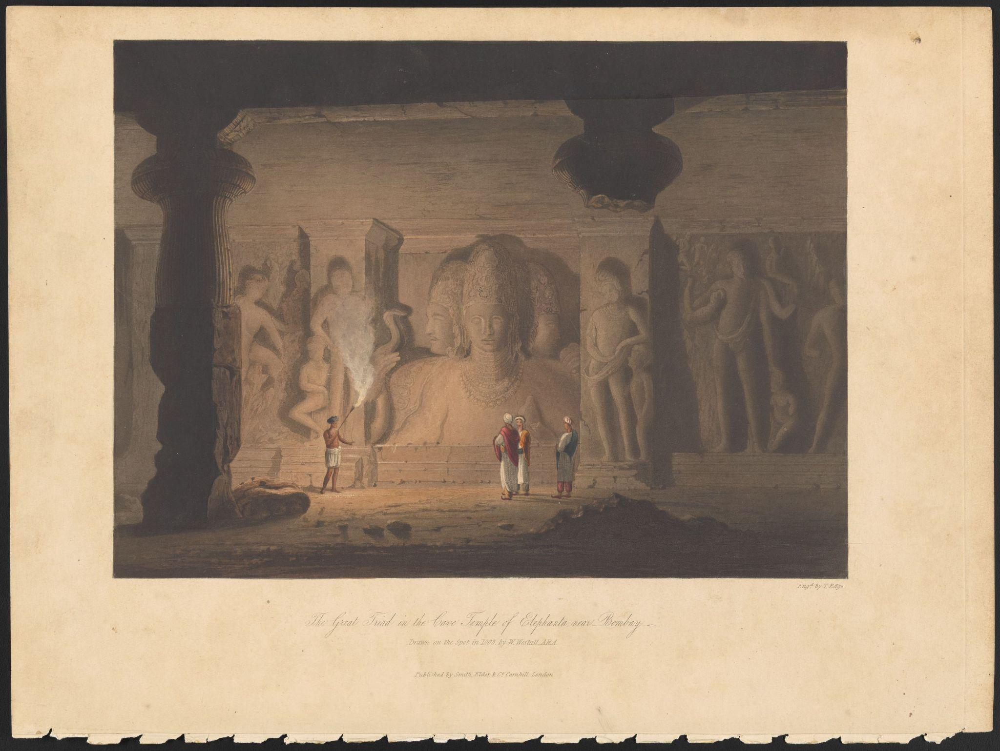
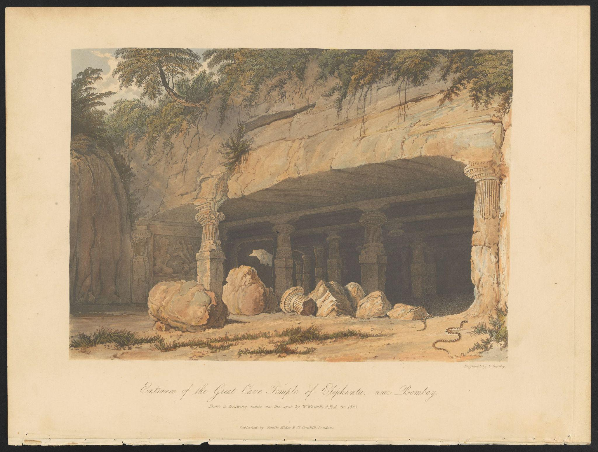
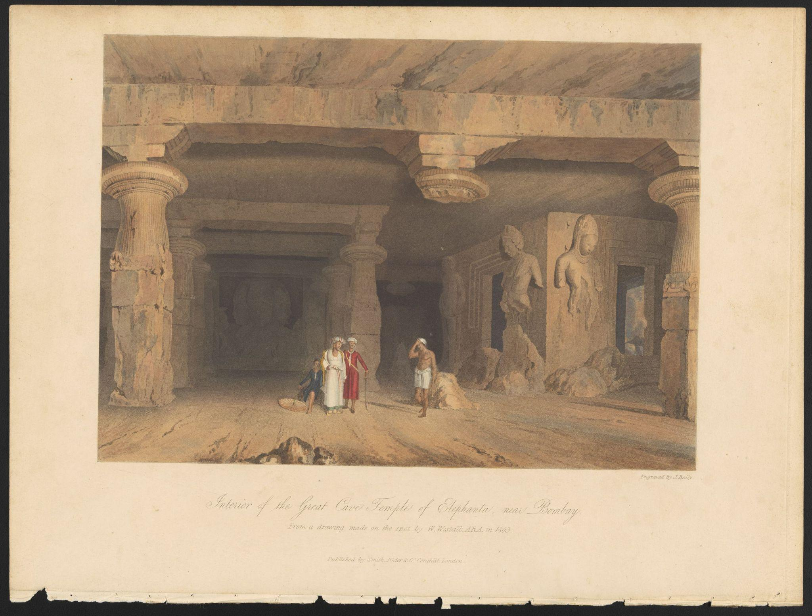
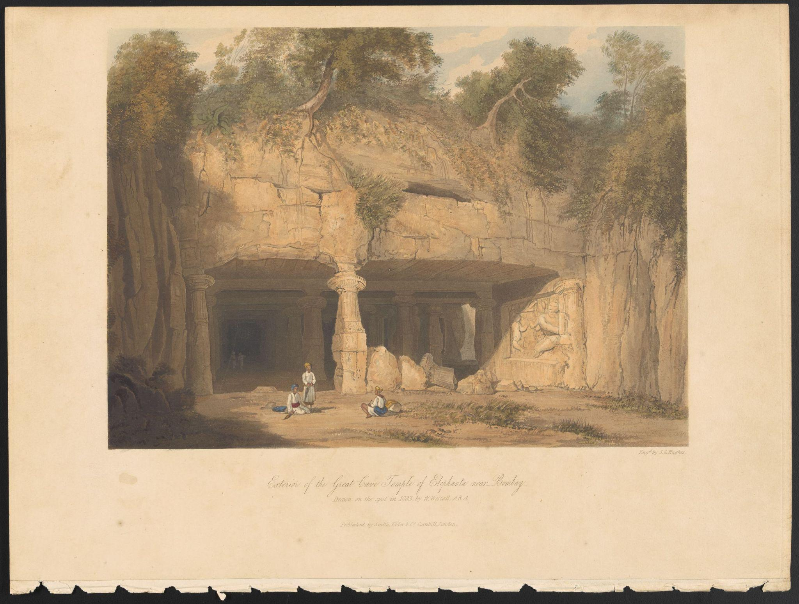
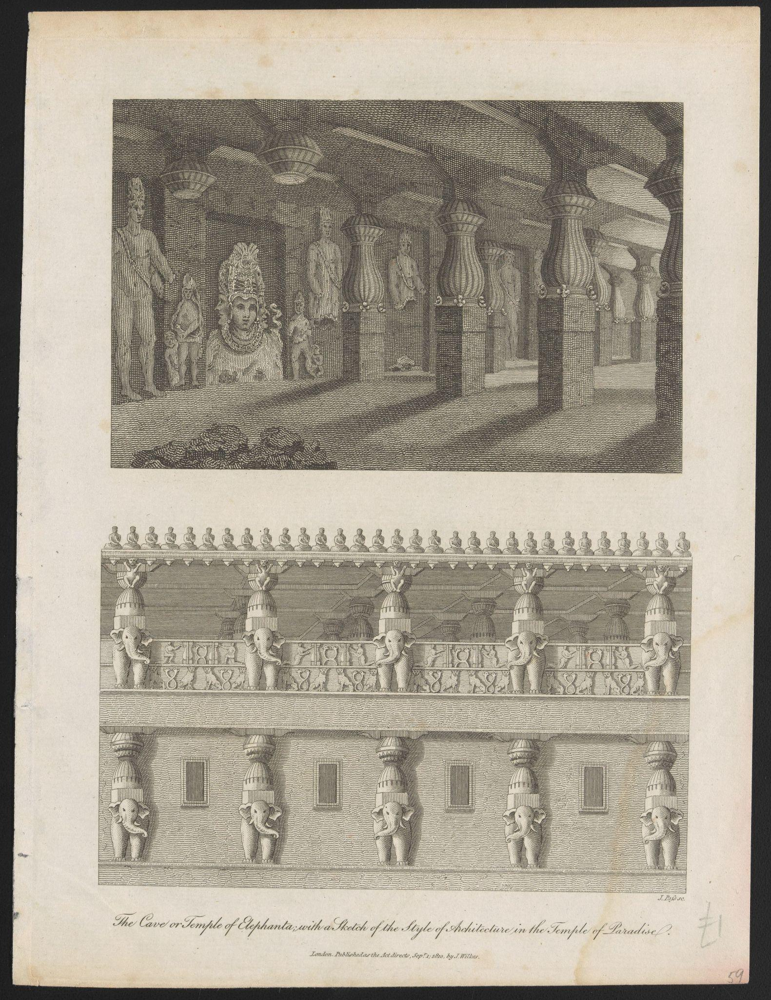

---

title: "Imperial Vision and Sacred Space"
description: "The Great Triad in the Cave Temple of Elephanta near Bombay"

---

<ExhibitPanel variant="default">

# Imperial Vision and Sacred Space:  *The Great Triad in the Cave Temple of Elephanta near Bombay* 

<small>Ashley Kim</small>

The cave temples of Elephanta form one of the most striking surviving
monuments of early medieval Indian sculpture. Carved into the volcanic
rock of Elephanta Island near Bombay (present-day Mumbai), the complex
preserves a monumental Hindu sanctuary. At its center is a colossal
three-faced image of the god Shiva (Sadashiva), conceived as an
embodiment of cosmic power expressing the fierce, pensive, and gentle
aspects of the deity within a unified sculptural presence.[^1] By the
early nineteenth century, however, British explorers encountered
monuments like Elephanta less as religious sites than as subjects for
antiquarian study. William Westall's depiction of *The Great Triad in
the Cave Temple of Elephanta near Bombay* (Fig. 1) demonstrates how
British visual culture turned sacred Indian architecture into sites of
imperial surveillance and Orientalist spectacle for European audiences.

Westall (1781--1850) drew *The Great Triad* on site while traveling with
the East India Company in 1803. The image later underwent several stages
of production before appearing as an aquatint. T. Edge engraved the
plate, which Captain Robert Melville Grindlay (1786--1877)---a British
military officer and entrepreneur---issued as part of a larger project
documenting Indian landscapes and architecture for metropolitan
audiences. Published in London by Smith, Elder, and Co., the print
appeared in Grindlay's illustrated volume *Scenery, Costumes and
Architecture, Chiefly on the Western Side of India* (1826--1830).[^2] In
this form, the monumental sculpture of Shiva at Elephanta was translated
into a reproducible image for consumption by distant viewers.

Art produced in India by British artists during the East India Company
years is often associated with the genre of Company painting---works
typically commissioned for private patrons and circulated within elite
domestic spaces. Illustrated travel publications operated differently:
books like *Scenery, Costumes and Architecture* disseminated images of
Indian landscapes and monuments through printed volumes circulating
within imperial networks of trade, travel, and antiquarian curiosity.
Within this context, Westall's *Great Triad* functioned as one of
several Elephanta views guiding metropolitan readers through the cave
complex. Now preserved as a separate aquatint sheet---removed from the
bound folio in which it originally circulated---the print records the
shifting material life of these images as they moved from imperial
publication to archival collection.

Viewers of *The Great Triad* encounter Shiva from deep within the dim
interior of the Elephanta caves. The deity's triadic form dominates the
rock wall, flanked by guardian figures embedded in triple height
pillars. These architectural elements frame the sculpture and emphasize
its grand scale. In the foreground, four figures occupy the temple
floor: three turbaned men in colorful layered shawls and a barefoot
torchbearer who directs his flame toward the sculpture, guiding both the
men and the viewer's gaze toward Shiva.

The torchlight reveals the broad contours of the Shiva carving but
obscures more delicate iconographic elements, including his third eye
and attributes such as the crescent moon or serpents. Their partial
disappearance in the print reflects both the technical limits of
aquatint reproduction and the artist's incomplete grasp of the
monument's theological complexity or Hindu culture whatsoever.

The viewing position established in Westall's image becomes especially
significant when considered within colonial depictions of Oriental
landscapes. British artists frequently framed Indian monuments through
picturesque conventions emphasizing ruins, natural scenery and
architectural spectacle while minimizing iconographic details and
ornamentation within religious sites. Such images positioned viewers
within a detached observational framework that transformed monuments
into spectacles for distant audiences.[^3] In this sense, the image
operates through a touristic gaze: the European observer remains outside
the frame while local figures appear primarily as markers of scale and
access. In the *Great Triad*, the torch-bearing guide and surrounding
figures direct the viewer's gaze toward the sculpture, reinforcing the
spectator's detached position within the cavern interior.

The logic of staged viewing becomes clearer when the image is considered
alongside other Elephanta views published within Grindlay's illustrated
folio (Figs. 2--4). Other Elephanta views illustrate the cave's
entrance, interior hall, and exterior approach, forming a visual
itinerary that culminates in the monumental sculpture represented in the
Great Triad. These images guide the viewer progressively through the
site, transforming the temple complex into an ordered sequence of
viewpoints that simulate the experience of a guided tour through the
monument.

Yet the publication's framing also exposes the limits of colonial
knowledge. Grindlay's title promises views "chiefly on the western side
of India," but the volume assembles images from a far broader geography,
including scenes from Ceylon (present-day Sri Lanka). Rather than
documenting a clearly defined region, the series constructs a loosely
organized panorama of imperial territory. In this process, sites that
originally functioned as centers of sacred ritual were reframed as
architectural monuments within systems of colonial documentation and
visual study.[^4]

A different strategy of visual translation appears in J. Pass's
engraving *The Cave or Temple of Elephanta, with a Sketch of the Style
of Architecture in the Temple of Paradise* (Fig. 5). Produced for
*Encyclopaedia Londinensis* in 1810, the engraving divides the monument
into two distinct visual registers: a perspectival view of the cave
interior and a schematic architectural comparison placed above it. The
upper diagram isolates structural elements of the monument and aligns
them with the "Temple of Paradise," suggesting an attempt to classify
Indian architecture within a broader framework of imperialist
fantasy.[^5] Such encyclopedic images functioned not merely as
illustrations but as tools of antiquarian description, presenting
distant monuments to European readers through a detached observational
framework. While Westall's aquatint emphasizes atmospheric
encounter---the dim interior, the torchlight, and the scale of the
sculpture---Pass's engraving instead approaches the site as an object of
analytical study. Yet this classificatory impulse produces its own
distortions. By fragmenting the monument into diagrammatic elements, the
engraving reduces the sacred space to a comparative architectural type.

Seen together, these images demonstrate how early nineteenth-century
British visual culture approached the Elephanta caves through different
yet equally partial forms of understanding, translating religious
architecture into scenery, specimen, and monument. If Pass's engraving
reveals the classificatory impulse of encyclopedic knowledge, Westall's
image---circulated through Grindlay's illustrated publication---offers a
different but equally mediated mode of encounter.

Preserved today within the Donald K. Adams and Lawrence D. Stewart
Collection at Northwestern University's McCormick Library of Special
Collections, these aquatint sheets---torn from their original bound
folios---record the archival afterlives of early nineteenth-century
illustrated publications. In *The Great Triad in the Cave Temple of
Elephanta near Bombay*, the monumental image of Shiva---once conceived
as an embodiment of cosmic power---appears through a European rendering
that recasts its interior for distant viewing. Framed by pillars and
torchlight, the composition directs attention toward the triad even as
iconographic details central to its Hindu meaning fade from view. Just
as the original sculpture operated within networks of ritual practice
and pilgrimage, the aquatint entered a different system of circulation,
translating Indian monuments into visual knowledge for imperial
audiences. Seen alongside related engravings, it reveals how British
visual culture transformed sacred architecture into images legible under
Orientalist spectacle and imperial observation.

Appendix

Figure 1.

William Westall (1781--1850), *The Great Triad in the Cave Temple of
Elephanta near Bombay*. Aquatint engraved by T. Edge, in Robert Melville
Grindlay, *Scenery, Costumes and Architecture, Chiefly on the Western
Side of India* (London: Smith, Elder, and Co., 1826--1830). Donald K.
Adams and Lawrence D. Stewart Collection of Prints, Northwestern
University Libraries.

Figure 2.

William Westall (1781--1850), *View of the Entrance to the Great Cave
Temple of Elephanta*. Aquatint engraved by T. Edge, in Robert Melville
Grindlay, *Scenery, Costumes and Architecture, Chiefly on the Western
Side of India* (London: Smith, Elder, and Co., 1826--1830). Donald K.
Adams and Lawrence D. Stewart Collection of Prints, Northwestern
University Libraries.

Figure 3.

William Westall (1781--1850), *Interior of the Great Cave Temple of
Elephanta near Bombay*. Aquatint engraved by T. Edge, in Robert Melville
Grindlay, *Scenery, Costumes and Architecture, Chiefly on the Western
Side of India* (London: Smith, Elder, and Co., 1826--1830). Donald K.
Adams and Lawrence D. Stewart Collection of Prints, Northwestern
University Libraries.

Figure 4.

William Westall (1781--1850), *Exterior of the Great Cave Temple of
Elephanta near Bombay*. Aquatint engraved by T. Edge, in Robert Melville
Grindlay, *Scenery, Costumes and Architecture, Chiefly on the Western
Side of India* (London: Smith, Elder, and Co., 1826--1830). Donald K.
Adams and Lawrence D. Stewart Collection of Prints, Northwestern
University Libraries.

Figure 5.

J. Pass, *The Cave or Temple of Elephanta, with a Sketch of the Style of
Architecture in the Temple of Paradise*. Engraving, in *Encyclopaedia
Londinensis* (London, 1810). Northwestern University Libraries.

Bibliography

Guha-Thakurta, Tapati. *Monuments, Objects, Histories: Institutions of
Art in Colonial and Post-Colonial India*. New York: Columbia University
Press, 2004.

Knapp, Bettina L. "The Dance of Siva: Malraux, Motion and Multiplicity."
*Twentieth Century Literature* 24, no. 3 (1978): 358--71.
https://doi.org/10.2307/441277.

Meister, Michael W. "Access and Axes of Indian Temples." *Thresholds* 32
(2006): 35--40.

Pass, J. *The Cave or Temple of Elephanta, with a Sketch of the Style of
Architecture in the Temple of Paradise*. Engraving. In *Encyclopaedia
Londinensis*. London, 1810. Northwestern University Libraries Digital
Collections.

Westall, William. *The Great Triad in the Cave Temple of Elephanta near
Bombay*. Aquatint engraved by T. Edge. In Robert Melville Grindlay,
*Scenery, Costumes and Architecture, Chiefly on the Western Side of
India*. London: Smith, Elder, and Co., 1826--1830. Northwestern
University Libraries Digital Collections.

[^1]: Knapp, Bettina L. "The Dance of Siva: Malraux, Motion and
    Multiplicity." *Twentieth Century Literature* 24, no. 3 (1978): 363.
   [https://doi-org.turing.library.northwestern.edu/10.2307/441277](https://doi-org.turing.library.northwestern.edu/10.2307/441277).

[^2]: William Westall, *The Great Triad in the Cave Temple of Elephanta
    near Bombay*, aquatint engraved by T. Edge, in Robert Melville
    Grindlay, *Scenery, Costumes and Architecture, Chiefly on the
    Western Side of India* (London: Smith, Elder, and Co., 1826--1830),
    Donald K. Adams and Lawrence D. Stewart Collection of Prints,
    Northwestern University Libraries, Digital Collections.

[^3]: Tapati Guha-Thakurta, *Monuments, Objects, Histories: Institutions
    of Art in Colonial and Post-Colonial India* (New York: Columbia
    University Press, 2004), 12.

[^4]: Michael W. Meister, "Access and Axes of Indian Temples,"
    *Thresholds* 32 (2006): 35.

[^5]: J. Pass, *The Cave or Temple of Elephanta, with a Sketch of the
    Style of Architecture in the Temple of Paradise*, engraving, in
    *Encyclopaedia Londinensis* (London, 1810), Northwestern University
    Libraries, Digital Collections.

</ExhibitPanel>